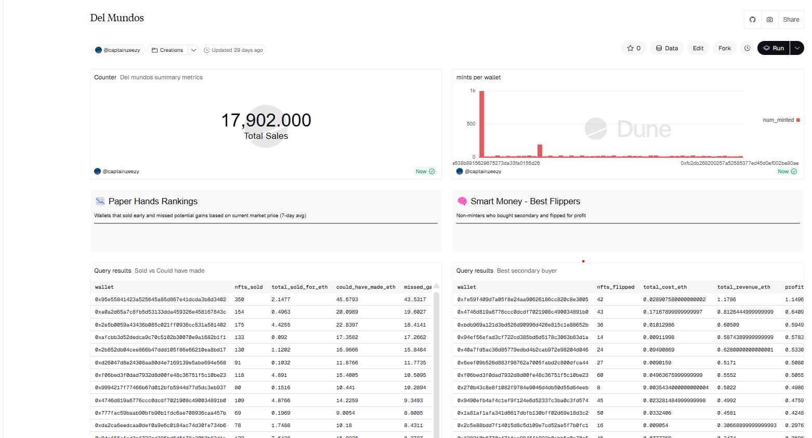

# Dune Analytics Portfolio

Blockchain data analysis dashboards built with SQL and Dune Analytics.

## 📊 Featured Dashboards

### Del Mundos NFT Analysis
**Live Dashboard:** https://dune.com/captainzeezy/del-mundos

Complete on-chain analysis of Del Mundos NFT collection:
- **10K mints** across **3.7K unique wallets**
- Identified paper hands who missed **0.7 ETH** in gains
- Tracked top flipper earning **1.1+ ETH** profit without minting
- Complete wallet P&L and trading pattern analysis

**Key Insights:**
- Wallet profitability rankings (realized gains/losses)
- Paper hands analysis using 7-day average pricing
- Secondary market profit tracking
- Mint distribution patterns

**Queries:**
- [Mints Per Wallet](dashboards/del-mundos/queries/01-mints-per-wallet.sql)
- [Paper Hands Analysis](dashboards/del-mundos/queries/02-paper-hands.sql)

**Full Documentation:** [View Here](dashboards/del-mundos/)

---

## 🛠️ Technical Skills

- SQL (CTEs, Window Functions, Aggregations)
- Blockchain Data Analysis (Ethereum, ERC721)
- NFT Market Analysis
- Data Visualization
- OpenSea Trade Data

## 📈 More Projects Coming Soon

- AI Agent Token Analysis
- Base Chain Trading Patterns
- DeFi Protocol Analytics

## 🔗 Connect

- **Dune:** [@captainzeezy](https://dune.com/captainzeezy)
- **Dashboard:** [Del Mundos Analysis](https://dune.com/captainzeezy/del-mundos)

---

*Last Updated: February 2026*
